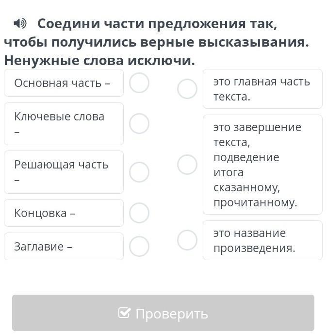

# Квиз

Платформы и технологии: Unity, Бэкенд, Веб, Десктоп, ИИ, Мобилка

# Задание

## Для новичков

Самый простой вариант, это сделать квиз, используя платформу Open Trivia - [https://opentdb.com/api_config.php](https://opentdb.com/api_config.php)

Работает очень просто - отправляете запрос на сервер с нужными параметрами, он выдаёт JSON, парсим его и даём пользователю возможность пройти квиз. Параметры квиза, естественно, должен задавать пользователь.

Также можно сделать галочки - рандомная категория и рандомная сложность.

В конце подсчитать количество правильных и неправильных ответов.

Ответ на вопрос должен быть ограничен 20 секундами, не забудьте отобразить таймер в UI.

Вопросы выдаются в случайном порядке.

## Для профи

Сделать свою Квиз систему.

Разработать БД, написать API.

Нужна будет панель администратора, с помощью которой можно создать квиз.

Варианты ответов:

- один ответ
- несколько ответов
- да/нет
- ответ в текстовом виде

К вопросу можно прикрепить картинку или видео со стороннего источника.

## Дополнительно

К варианту ответа можно прикрепить не только текст, но и картинку.

Попробуйте реализовать тип вопроса - «Соедини части предложений, чтобы получились верные утверждения»

Добавьте регистрацию и авторизацию.

Добавьте возможность регистрироваться или входить через Гугл, ВК или любые другие любимые соц сети.

Будет круто, если квиз будет генерировать нейросеть.

## ИИ

Пользователь задаёт количество вопросов и вписывает тему - нейросеть (любая gpt) должна сгенерировать соответствующий квиз.

## Бот

Реализуйте квиз с помощью бота.

Бот предлагает пользователю ввести количество вопросов и выбрать тему.

Затем, используя своё API или, например, Open Trivia - [https://opentdb.com/api_config.php](https://opentdb.com/api_config.php) сгенерировать квиз.

Для выбора ответов нужно создавать соответствующие кнопки.

Ограничьте вопрос по времени.

Будет круто, если квиз будет генерировать нейросеть.
